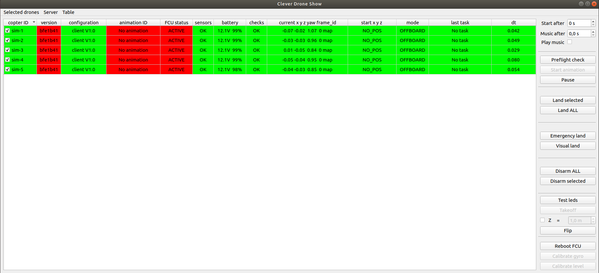
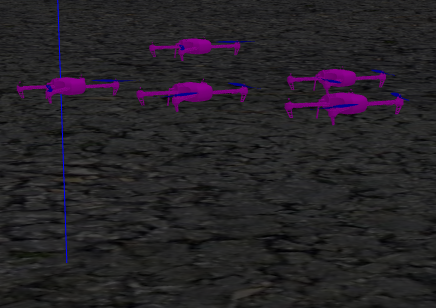

# clever-show-ds

Software kit for multiple Clover drones simulation. Each simulated drone contains roscore, clever, sitl and clever-show services running inside.


### Simulate copters in Gazebo

* Ubuntu 18.04
* ROS Melodic Desktop-Full Install ([install instruction](http://wiki.ros.org/melodic/Installation/Ubuntu))
* docker ([install instruction](https://docs.docker.com/get-docker/))

## Prepare

Clone this repository, cd into it and pull docker image:

```cmd
git clone https://github.com/Iliaaer/Dron-show/.git
cd <cloned repo>
docker pull goldarte/clever-show-ds
```

## Simulate multiple copters in Gazebo

Launch Gazebo simulator with empty world and generate 2 px4 copters with simulated companion computers:

```cmd
python simulate.py -n 2
```


> If you get message:
>
> ```cmd
> You don't have roslaunch module! Please, check your ROS installation.
> ```
>
> check that you have ROS installed and add `source /opt/ros/melodic/setup.bash` to the end of ~/.bashrc file.

## Configure

You can configure simulation script:

```cmd
python simulate.py [-h] [-n NUMBER] [-p PORT] [-d DIST] [--headless]

Simulate multiple Clover copters

optional arguments:
  -h, --help            show this help message and exit
  -n NUMBER, --number NUMBER
                        Number of copters to simulate. Default is 1.
  -p PORT, --port PORT  UDP port for simulation data of the first copter.
                        Default is 14601. UDP port for n-th copter will be
                        equal to <port> + n - 1. This parameter is used only
                        in non headless mode.
  -d DIST, --dist DIST  Distance between generated copters in meters. Default
                        is 1. The generated copters will be arranged as a 2D
                        array along East and North axes in a shape close to
                        square.
  --headless            Set this option to run internal lightweight simulation.
```

## Simulate drone show

You can control generated copters from [clever-show](https://github.com/CopterExpress/clever-show) server and simulate the drone show with it.

Clone [clever-show](https://github.com/CopterExpress/clever-show) repository and cd to it

```cmd
git clone https://github.com/CopterExpress/clever-show.git
cd <cloned repo>
```

Setup requirements with pip3

```cmd
pip3 install -r requirements.txt
```

Run clever-show server GUI

```cmd
cd Server
python3 server_qt.py
```

Change option `send_ip` in `BROADCAST` section to `172.17.255.255` by clicking `Server` -> `Edit server config`


Check option `Restart` and click `Save` button.

Wait until all simulated copters connect to server automatically.


Test copters by selecting them all (ctrl+A) and clicking `Takeoff` button on the right panel of GUI.





Land copters by clicking `Land ALL` button on the right panel of GUI.

More documentation about [clever-show](https://github.com/CopterExpress/clever-show#documentation) software can be found in the Github repository.

## Run container standalone

Use `run` script to run container standalone. You can specify next options:

```cmd
./run [options]

Options:
  -h --help         Print this message
  -i --id=ID        ID of simulated copter. Used as MAV_SYS_ID.
                    Container name and hostname are set to sim-<ID> (default: 1)
  -p --port=PORT    Initial UDP port (default: 14560)
                    UDP listening port for simulator data is set to <PORT>+<ID>
  --headless        Set this option to run lightweight jmavsim simulator directly in container
  --lat=LATITUDE    Set initial latitude
  --lon=LONGITUDE   Set initial longitude
  --dx=DX           Set dx shift in meters to East (default: 0)
  --dy=DY           Set dy shift in meters to North (default: 0)
See defaults for initial latitude and longitude here:
https://github.com/goldarte/clover-ds/blob/master/scripts/calculate_gps.py#L7

```

> Each time you want to run new container it must have unique ID and UDP port for simulator data!

There will be 4 services running inside the container: roscore, clover, sitl and clever-show. If you set `--headless` option, there will be running jmavsim service also.

You can manage running services inside the container using `systemctl` and watch their logs with `journalctl -u <service name>`. For example if you want to restart the service `clover`, just use `systemctl restart clover`.

If you want to open new terminal session in working container, use following command:

```cmd
docker exec -it <container name> bash
```

To stop or kill containers you can use

```cmd
docker stop <container name>
docker kill <container name>
```

To get information about running containers you can use

```cmd
docker ps
```
